# CET-4 词缀翻卡记忆站 — 流程图集

> 版本：v1.0（2026-02）
> 依据：`README.md`、`foundation/idea.txt`、`foundation/DESIGN.md` v1.1、`foundation/TECH_SPEC.md` v1.1、`foundation/CET4.md`
> 图表格式：Mermaid（GitHub 网页、VS Code 预览、Typora 均可直接渲染；渲染器自带 Mermaid 时无需联网）
> 本文件是**派生产物**：只描述上面四份文档已经确定的事实，不引入新的设计决策。凡本文与源文档冲突之处，以源文档为准，并见 §10「图与文档口径对照」。

---

## 0. 怎么读这份图集

### 0.1 图例

| 标记 | 含义 | 图中样式 |
|---|---|---|
| 【已完成】 | 现状已落地、可复现 | 绿底实线 |
| 【未实现】 | 方案已定、代码尚未写（对应 `README.md` 项目状态表） | 黄底虚线 |
| 【守卫】 | 自动校验 / 门禁，失败即构建失败 | 蓝底实线 |
| 【人工】 | 需要人工或子代理介入的环节 | 红底实线 |
| 【产物】 | 落盘文件（图中画成圆柱） | 白底圆柱 |
| 【判定】 | 分支判断（图中画成菱形） | 橙底菱形 |

### 0.2 图集清单

| # | 图 | 回答什么问题 |
|---|---|---|
| 1 | 项目总览 | 这个仓库一共发生了几件事、彼此什么关系 |
| 1b | 三层架构 | 哪一层是只读输入、哪一层可以改动 |
| 2 | 数据管线主流程（四段式） | 5070 词候选库怎么变成 1998 词成品表 |
| 3 | 分片 → 标注 → 回灌循环 | 为什么标注可以并行、可以返工 |
| 4 | 体检与人工修正旁路 | 数据错在哪里、怎么被修回来 |
| 5 | 网页版构建管线 | TSV 怎么变成 `words.js` 与单文件便携版 |
| 6 | Unit Builder 三级策略 | 260 个词根怎么变成 312 个可展示的学习单元 |
| 7 | 数据契约门禁（10 条断言） | 什么样的脏数据进不了前端 |
| 8 | 运行期状态机 | 四个视图之间怎么流转 |
| 9 | 取词与分页算法 | 「不重不漏」是怎么被证明的 |
| 10 | 翻卡交互状态图 | `hidden / front / back` 三态与点击行为 |
| 11 | 启动探测与三级降级阶梯 | 老电脑上怎么不白屏、不掉帧 |
| 12 | 持久化、跨天与版本失效 | 刷新、跨天、词库重建后各发生什么 |
| 13 | 一次完整学习会话（时序） | 「选 7 → 学完 → 添加 6」逐帧发生了什么 |
| 14 | 里程碑流程 | M0→M3 的依赖与并行关系 |

---

## 1. 项目总览

**一句话**：一条已经跑通的数据管线产出两张成品——一张**直接可用的 Excel 表**（已完成），和一个**以它为唯一数据上游的网页版**（方案已定、未实现）。

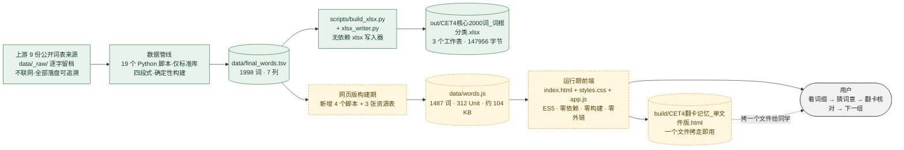

**三层架构**（`TECH_SPEC.md` §2 的原文口径，单向数据流：构建期把知识组织成产品形态，运行期只做渲染）：

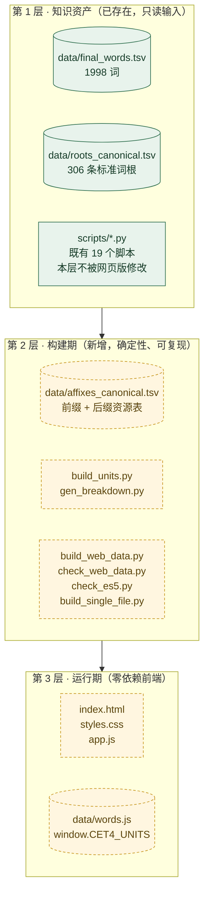

---

## 2. 数据管线主流程（四段式）【已完成·可复现】

分割点选在**可独立重跑的边界**上，因此每一段都可以单独重跑而不影响其他段：

- **① 采集与解析**：网络取回 + 原始词表 → 规整 TSV
- **② 分片 → 标注 → 回灌**：人工/子代理可并行的部分，回灌永远是确定的
- **③ 复核与补标**：对已成形词表做多词根复核、无词根补标、归一与回填
- **④ 体检与成品**：改名/纠错检查 + 生成 xlsx

```mermaid
flowchart TD
    classDef done fill:#e8f3ec,stroke:#2f6f4e,stroke-width:1px,color:#173d29
    classDef gate fill:#eef2f7,stroke:#4a6785,stroke-width:1px,color:#1f3348
    classDef human fill:#f7eeee,stroke:#a34a4a,stroke-width:1px,color:#5c2626

    subgraph S1["① 采集与解析"]
        direction TB
        NET["web_fetch 取回上游文件<br/>本机无直连网络"]
        RAW[("data/_raw/<br/>8 个文件逐字留档")]
        AS1[("data/cet4_AS.tsv<br/>3517 词 · A–S 主干<br/>web_fetch 截断位置")]
        PS["data/parse_source.py<br/>去重 · 编码规整 · 合并"]
        TZ[("data/cet4_TZ_source.tsv<br/>T–Z 段")]
        FULL[("data/cet4_full_source.tsv<br/>5070 词候选库 · A–Z")]
        PW["scripts/parse_wordlist.py<br/>大纲词表行 → TSV<br/>支持 word [音标] pos.释义"]
    end

    subgraph S2["② 分片 → 标注 → 回灌"]
        direction TB
        CH[("data/chunks/ 20 片<br/>as_01 … as_20")]
        MC["scripts/merge_chunks.py<br/>逐行对齐校验"]
        TAG[("data/tagged_AS.tsv<br/>7 列带标注")]
        SC["scripts/split_core.py<br/>按候选核心词分片"]
        CORE[("data/core/ 17 片 + 索引<br/>word/tier/root/meaning")]
        KIN["人工 / 子代理<br/>补词根 + 筛选"]
        KOUT[("data/keep/ 17 片<br/>word/root/keep")]
        AK["scripts/apply_keep.py"]
        FAS[("data/final_AS.tsv<br/>1593 词")]
        BN["scripts/build_new.py<br/>候选库 − A–S 截断"]
        NEW[("data/new/ 12 片<br/>data/cet4_new.tsv 1553 词")]
        NIN["人工 / 子代理<br/>四档筛选"]
        NOUT[("data/newkeep/ 12 片")]
        MT["scripts/make_topup.py<br/>挑被 50% 配额刷掉的 tier1/2 词"]
        TOP[("data/topup/ 2 片")]
        ATK["scripts/apply_topup_keep.py<br/>补足到 2000 词目标<br/>每片固定保留 KEEP_N 词"]
        TOK[("data/topupkeep/ 2 片")]
        ASM["scripts/assemble.py<br/>A–S 段 + S尾/T–Z 段合并<br/>并读 newkeep / topupkeep / topup"]
        FALL[("data/final_ALL.tsv<br/>1998 词")]
    end

    subgraph S3["③ 复核与补标"]
        direction TB
        SM["scripts/split_multi.py"]
        MUL[("data/multi/")]
        MIN["人工 / 子代理<br/>多词根复核"]
        MOK[("data/multikeep/")]
        AM["scripts/apply_multi.py<br/>严格规则：两个词根都必须在标准表内<br/>原表已有的中文释义优先"]
        FW1[("data/final_words.tsv")]
        SF["scripts/split_fill.py<br/>拆出无词根词"]
        FIL[("data/fill/ 每片 120 词")]
        FIN["人工 / 子代理<br/>补标词根"]
        FOK[("data/fillkeep/")]
        AF["scripts/apply_fill.py<br/>只填被标为保留的词"]
        FW2[("data/final_words.tsv")]
        NR["scripts/normalize_roots.py<br/>按 root_fix.tsv 统一重名 / 变体"]
        FP["scripts/fill_phonetic.py<br/>从 _raw 回填缺失音标"]
        FW3[("data/final_words.tsv<br/>1998 词 · 1151 带词根<br/>音标 1865 · 释义 1992")]
    end

    subgraph S4["④ 体检与成品"]
        direction TB
        AR["scripts/audit_roots.py<br/>重名键 0 · 非标准写法 0"]
        CP["scripts/check_phonetic.py<br/>默认只报告，加参数才修复"]
        AD["scripts/analyze_derivatives.py<br/>透明派生词统计"]
        BX["scripts/build_xlsx.py<br/>确定性构建：重复执行字节一致"]
        XLS[("out/CET4核心2000词_词根分类.xlsx<br/>词根分类词汇表 / 词根索引 / 说明<br/>147956 字节 · 约 0.3 秒")]
    end

    NET --> RAW
    RAW --> PW --> AS1
    RAW --> PS
    AS1 --> PS
    PS --> TZ
    PS --> FULL

    AS1 --> CH --> MC --> TAG
    TAG --> SC --> CORE --> KIN --> KOUT --> AK --> FAS
    FULL --> BN
    AS1 --> BN
    BN --> NEW --> NIN --> NOUT
    NEW --> MT
    NOUT --> MT
    MT --> TOP --> ATK --> TOK
    FAS --> ASM
    NOUT --> ASM
    TOK --> ASM
    TOP --> ASM
    NEW --> ASM
    ASM --> FALL

    FALL --> SM --> MUL --> MIN --> MOK --> AM --> FW1
    FW1 --> SF --> FIL --> FIN --> FOK --> AF --> FW2
    FW2 --> NR --> FP --> FW3

    FW3 --> AR
    FW3 --> CP
    FW3 --> AD
    FW3 --> BX --> XLS

    class NET,RAW,AS1,PS,TZ,FULL,PW,CH,MC,TAG,SC,CORE,AK,FAS,BN,NEW,MT,ATK,ASM,FALL,SM,AM,FW1,SF,AF,FW2,NR,FP,FW3,BX,XLS done
    class KIN,NIN,MIN,FIN human
    class KOUT,NOUT,TOP,TOK,MUL,MOK,FIL,FOK done
    class AR,CP,AD gate
```

> **为什么 `assemble.py` 排在 `apply_multi.py` 之前**：`final_words.tsv` 是由 `apply_multi.py` 从 `final_ALL.tsv` 生成的（`apply_multi.py` 第 62 行读 `final_ALL.tsv`、第 119 行写 `final_words.tsv`），所以「合并 A–S 与 T–Z」必须先于「多词根复核」。`README.md`「应用管线」一节把七步写成 `core → keep → multi → fill → normalize → assemble → build_xlsx`，是**摘要顺序**，与脚本级依赖顺序不同，见 §10.2。

---

## 3. 分片 → 标注 → 回灌循环

管线里有**五轮同构的循环**（core / new / topup / multi / fill）。它们的共同形状是：把几百个词拆成小分片 → 交给人工或子代理并行标注 → 用脚本回灌。**好处是标注过程可以并行、可以返工，而回灌永远是确定的。**

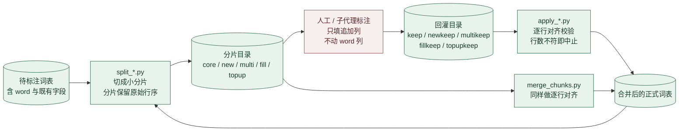

**五轮循环的对照**：

| 轮次 | 拆片脚本 | 标注目录 | 回灌脚本 | 回灌目标 | 人工在判断什么 |
|---|---|---|---|---|---|
| ① core | `split_core.py` | `data/core/`（17 片）→ `data/keep/`（17 片） | `apply_keep.py` | `final_AS.tsv` | 该词是否收录、词根归哪 |
| ② new | `build_new.py`（天然分片，12 片） | `data/new/` → `data/newkeep/` | `assemble.py` | `final_ALL.tsv` | 新词块是否属于四级核心 |
| ②′ topup | `make_topup.py`（2 片，二次筛选） | `data/topup/` → `data/topupkeep/` | `apply_topup_keep.py`，再由 `assemble.py` 消费 | `final_ALL.tsv` | 被 50% 配额刷掉的高频词是否捞回 |
| ③ multi | `split_multi.py`（8 片） | `data/multi/` → `data/multikeep/` | `apply_multi.py` | `final_words.tsv` | 两个词根是否都成立 |
| ④ fill | `split_fill.py`（8 片，每片 120 词） | `data/fill/` → `data/fillkeep/` | `apply_fill.py` | `final_words.tsv` | 无词根词能否补上词根 |

> **关键约束**：回灌只认**行序对齐**。因此标注者只能追加/填充列，不能增删行、不能重排——这是「可以返工」的前提，也是 `merge_chunks.py` 存在的唯一理由。

---

## 4. 体检与人工修正旁路

三个体检脚本**默认只报告、不生产数据**；问题通过人工修正表与回填脚本回流到管线。

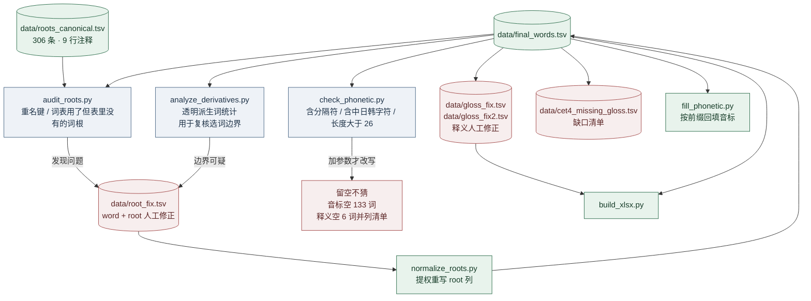

> **数据可信度的来源**：处理缺口的方式是**留空 + 记录缺口清单**，从不根据拼写猜音标、根据上下文编释义。`source_notes.md` 连「某份来源是 Big5 编码、按 UTF-8 解码会毁掉全部中文释义，故弃用」这类判断都写下来了。

---

## 5. 网页版构建管线【方案已定·未实现】

网页版**不修改数据管线的任何产物**，只在 `final_words.tsv` 之上增加一个确定性构建步骤。

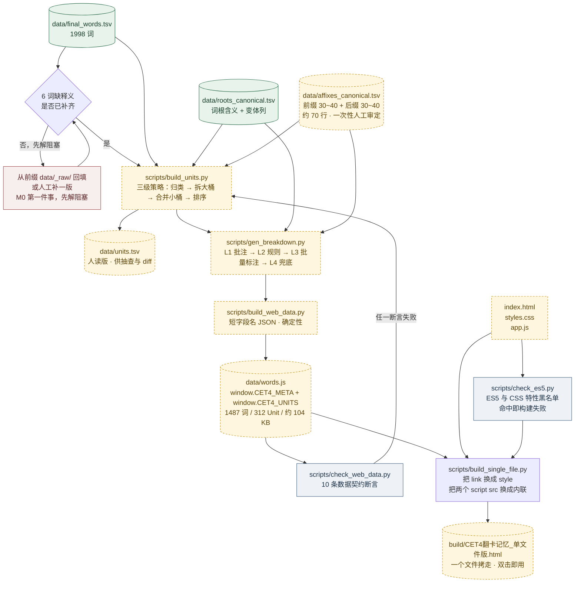

**体积实测（`TECH_SPEC.md` §3.7 / 附录 A.2，同一份 1487 词数据）**：

| 形态 | 体积 | 决策 |
|---|---|---|
| 长字段名结构化 JSON | 172 KB | 可读性最好，未采用为默认 |
| **短字段名 JSON（`w`/`p`/`m`/`b`/`t`）** | **104 KB** | **采用**：无自定义解析、无分隔符风险 |
| 紧凑字符串（`\|` + `~` 分隔） | 77 KB | 仅省 27 KB，却有静默错行风险 → 降为 `--format=compact` 可选开关 |
| 紧凑串 gzip | 37 KB | `file://` 下不可依赖，仅供参考 |

> 这次**实测推翻了 v1.0 的 350 KB 估计**（高估 2~4.5 倍）：体积根本不是瓶颈，因此不必为省 27 KB 引入自定义分隔符解析。实测数据里已有 99 条释义含 ASCII 分号，若用分号作分隔符会静默错行。

---

## 6. Unit Builder 三级策略

`DESIGN.md` 假设「一个词缀 5 个词、一页一词缀」，但实测词根规模极不均（57 个词根只带 1 词、`sist` 带 38 词）。因此引入 **Unit（学习单元）= 一个词缀面板 + 一组同族词**。

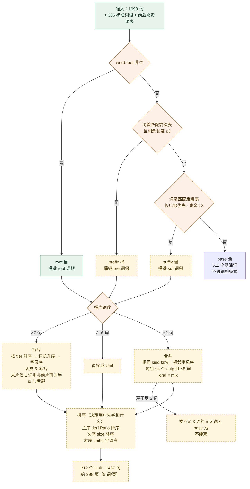

**实测分组结果**（探针实测，`TECH_SPEC.md` §3.2）：

| 指标 | 实测值 |
|---|---|
| 可用词（进入词缀模式） | **1487** / 1998 |
| 基础词（移出，如 `abandon`、`bargain`） | 511 |
| Unit 数 | **312**（词根 260 + 后缀 31 + 前缀 21） |
| ≤2 词需合并的 Unit | 132 个（198 词） |
| >6 词需拆分的 Unit | 66 个，最大 `sist` 38 词 |
| 展平后流长度 | 1487 词 ≈ **298 页** |

**排序的收益**：主序按 tier1 高频词占比降序，因此**用户前 20 页即覆盖最高频词根**；同族 38 词的 `sist` 被拆成 8 片，但集中在高优先级区。

---

## 7. 数据契约门禁：10 条断言

`scripts/check_web_data.py` 的断言清单，**任一失败即构建失败**，防止脏数据进前端：

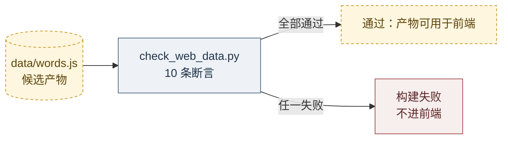

| # | 断言 | 挡住的是什么 |
|---|---|---|
| 1 | 词总数 = `final_words.tsv` 可用词数（1487 ± 白名单） | 构建脚本漏词/重复计数 |
| 2 | 每个 Unit 的 `words` 非空、`affixes` 非空、`kind` 合法 | 空 Unit 导致面板空白 |
| 3 | 无重复卡片键 `unitId + 单词`；**全局无重复单词** | 「添加单词」后语义重复 |
| 4 | 每个 `affix` 都能在词根表或词缀表中查到 | 非标准写法 / 错误拆分 |
| 5 | 每个词 `meaning` 非空 **或** 在已知 6 词白名单内 | 卡片无释义（最小可用度硬门槛） |
| 6 | 无空串 `breakdown`（允许 L4 的「该词暂无助记」） | 卡片背面空白 |
| 7 | 两次构建产出**字节一致** | 非确定性构建、diff 噪声 |
| 8 | 分隔符安全（**仅 compact 模式**）：任一字段不含 `\|`、`~`、换行 | 自定义格式静默错行 |
| 9 | 体积门限：`words.js` ≤ 250 KB、单文件版 ≤ 500 KB | 后续扩量时无声膨胀 |
| 10 | **零外部引用**：三个源文件不得出现 `http://` / `https://` / `//cdn` | 断网与 `file://` 可用性 |

---

## 8. 运行期：状态机、取词、翻卡与降级

### 8.1 四态机（`DESIGN.md` §3）

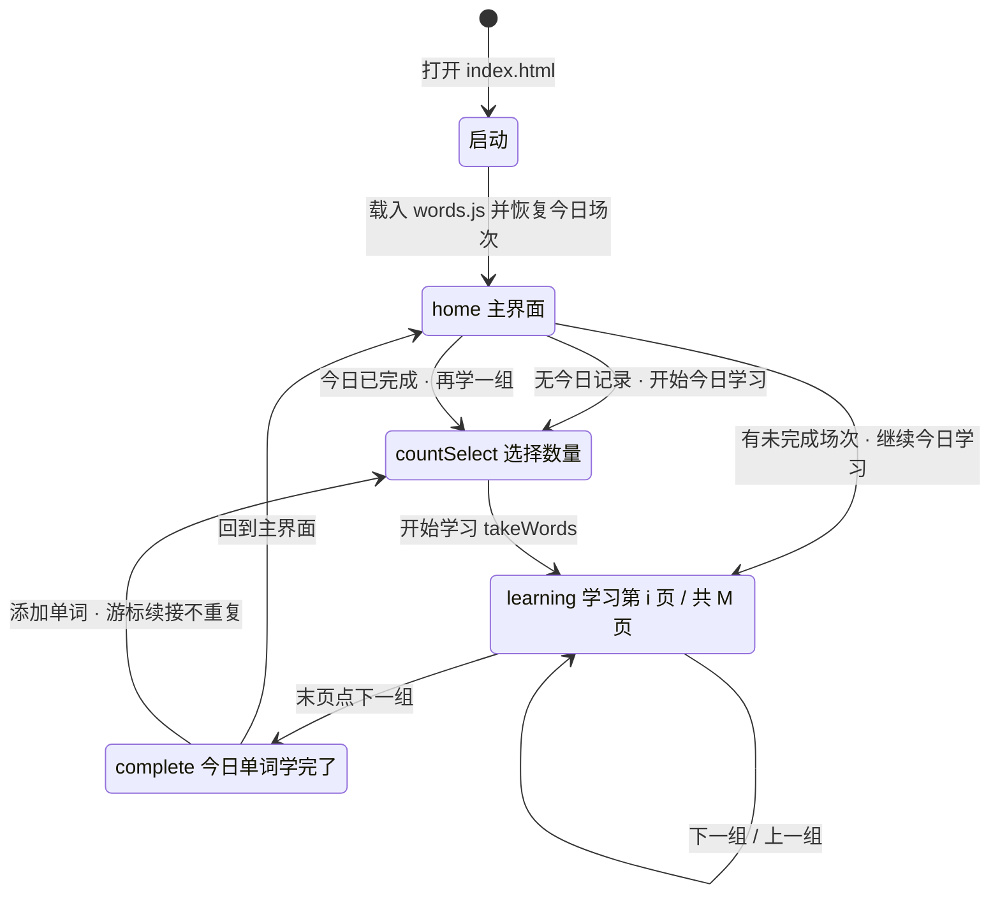

**关键约束**：「添加单词」不是重新开始，而是**在今日场次后追加新的页**，且必须跳过今日已学的单词。这由 §8.2 的取词游标天然保证——它把一条容易写错的业务规则，变成了一个不可能违反的数据结构性质。

`learning` 的三个子状态（`TECH_SPEC.md` §4.2）：

| 子状态 | 含义 |
|---|---|
| `pageIndex` | 当前页在今日 `pages` 中的下标 |
| `cardState` | 每张卡 `{ revealed, flipped }`，键 = `unitId + 单词` |
| `unitPanelState` | 本页面板 chip 的展开态（mix Unit 有 2~4 个 chip） |

### 8.2 取词与分页算法（核心，`DESIGN.md` §6）

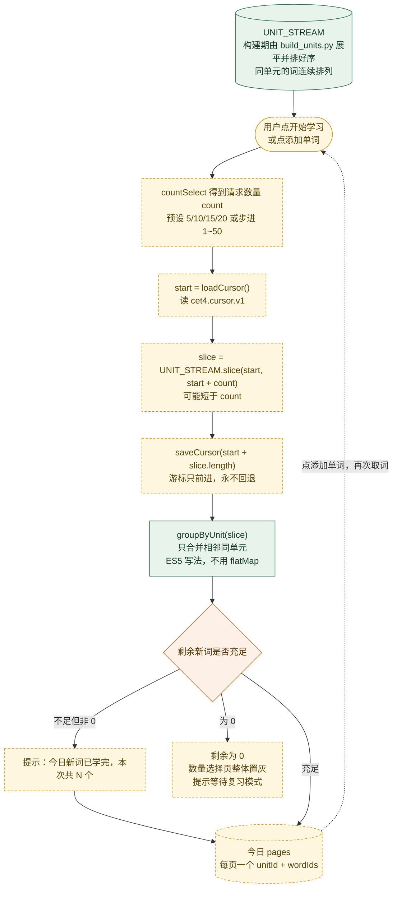

**为什么「不重不漏」是可证明的**：游标单调不减，任何一次 `takeWords` 都只发放在 `[start, start+n)` 区间内的词项；`saveCursor` 只写 `start + 实际取到数`，所以两批之间**区间必定不相交**。`groupByUnit` 只做相邻同单元合并，因此不改变顺序，也不再依赖 ES2019 的 `flatMap`（基线浏览器不可用）。

**示例（`DESIGN.md` §6.3）**：

| 回合 | 请求 | 得到 | 说明 |
|---|---|---|---|
| 第 1 回合 | 7 | 页 1 `re-` 5 词 + 页 2 `pre-` 2 词 | 末组不满 5 词，靠游标续接 |
| 第 2 回合（添加单词） | 6 | 页 3 `pre-` 剩余 3 词 + 页 4 `port` 3 词 | **与第 1 回合 13 个词两两不重复** |

### 8.3 翻卡交互状态图（`DESIGN.md` §5）

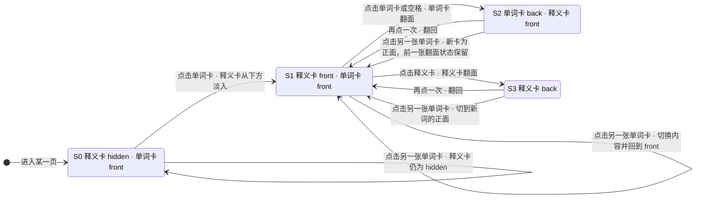

| 卡片 | 正面 | 背面 |
|---|---|---|
| 单词卡 | 单词 + 音标 | 词根拆分 + 助记 `breakdown` |
| 释义卡 | 词性 + 中文释义 | （无例句的降级版）词根拆分 + 词性 + 完整义项 |

**状态标记**：单词卡一旦被点击过，右上角出现小圆点；`flipped` 一经置 `true` 即永久保留（仅用于进度统计），但翻面本身**可反复翻回**；翻面是**本页内状态**，切到下一页重置为 `hidden`，通过「上一组」返回时恢复。

**键盘快捷键**：`1`~`5` 等价点击第 n 张卡，`空格` 翻面当前聚焦卡，`→` / `Enter` 下一组，`←` 上一组。

**渲染粒度（`TECH_SPEC.md` §4.8.3，老机器的关键优化）**：

| 变更 | 渲染范围 | 理由 |
|---|---|---|
| 点卡（弹释义 / 翻面 / 换个词看） | **只切类名 + 改文本**，不重建 | 单卡级 patch，零重排 |
| 切页（下一组 / 上一组） | 仅重建**卡片区 + 面板**，顶栏底栏复用 | 一次重建，页面骨架不动 |
| 切视图（四态之间） | 整体重建 | 频率最低，成本可忽略 |
| 计时器每秒刷新 | **只改一个文本节点** | 绝不用 `innerHTML` 重建顶栏 |

### 8.4 启动探测与三级降级阶梯（`DESIGN.md` §5.6 / §14.4）

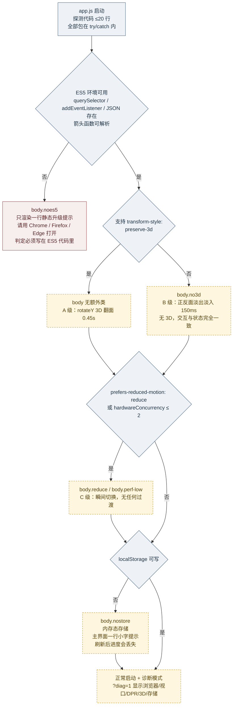

> **三级降级只影响观感，不影响功能**：A/B/C 三级下 `DESIGN.md` §5.1 的状态表与 §5.2 的点击行为**逐行成立**，所有验收项同样通过。

### 8.5 持久化、跨天与版本失效（`DESIGN.md` §7 / `TECH_SPEC.md` §4.4）

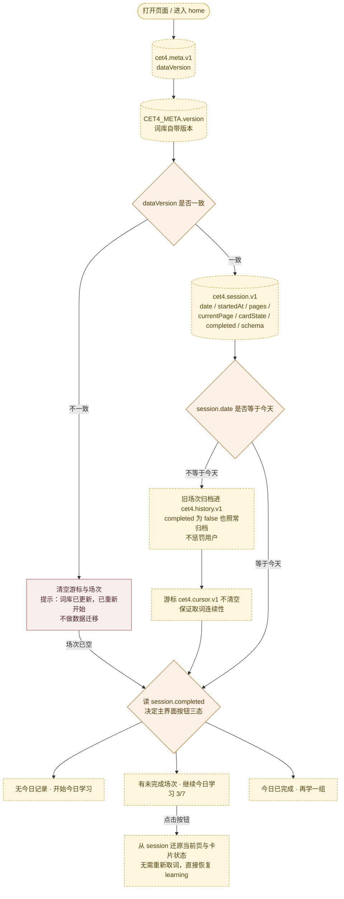

> **为什么必须做 `dataVersion` 校验**：游标是**数组下标**，词库重建后同一个下标会指向另一个词，语义漂移会导致用户重复或漏词。因此版本不一致时必须让游标失效，这是「宁可重来，不可错发」的取舍。
>
> **存储可用性兜底**：老电脑上 `localStorage` 可能因无痕模式、组策略或 `file://` 安全设置而**访问即抛 `SecurityError`**，因此所有读写必须包在 `try/catch` 内，失败时降级为内存态存储，并在主界面提示一行小字。**绝不允许因为存储异常导致白屏或按钮失灵。**

### 8.6 一次完整学习会话（时序）

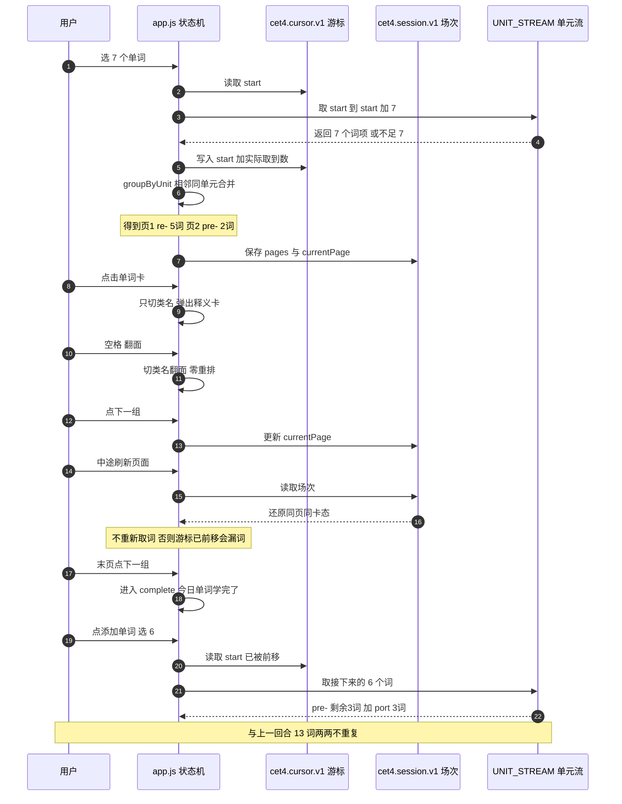

---

## 9. 里程碑流程（M0 → M3）

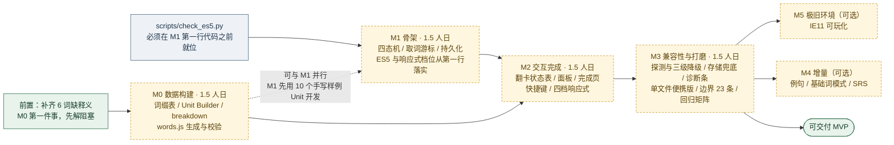

> **为什么 `check_es5.py` 要在 M1 之前就位**：ES6 语法一旦写进 `app.js`，回头改写比开写前约束贵得多。这条守卫把「我们承诺兼容老浏览器」从口头约定变成**机器可验证的断言**。

---

## 10. 图与文档口径对照

### 10.1 本文所有数字的核对结果

本文图中的数字**全部用只读探针现场复核过**，与 `README.md` / `CET4.md` 一致：

| 项 | 文档记载 | 实测 | 结论 |
|---|---|---|---|
| `final_words.tsv` 词数 | 1998 | 1998 行 · 全部 7 列 | ✅ 一致 |
| tier 分布 | 1: 859 / 2: 1139 | 859 / 1139 | ✅ 一致 |
| 带词根 / 无词根 | 1151 / 847 | 1151 行有 root | ✅ 一致 |
| 缺音标 | 133 | 133 行音标为空 | ✅ 一致 |
| 缺释义 | 6 | 6 行释义为空 | ✅ 一致 |
| `roots_canonical.tsv` | 306 条标准词根 | 306 数据行 + 9 注释行 | ✅ 一致 |
| `cet4_full_source.tsv` 候选库 | 5070 | 5070 行 | ✅ 一致 |
| `cet4_new.tsv` 新词 | 1553 | 1553 行 | ✅ 一致 |
| xlsx 体积 | 147956 字节 | 147956 字节 | ✅ 一致 |
| `scripts/` 脚本数 | 19 | 19 个 `.py` | ✅ 一致 |

### 10.2 四处需要留意的口径差异

1. **`data/_raw/` 是 8 个文件，不是 9 个**。`README.md` 说「9 份来源全部逐字留档」，指的是**上游来源份数**——其中 `mahavivo/english-wordlists · CET4_edited.txt`（A–S 主干）落盘在 `data/cet4_AS.tsv` 而非 `_raw/`，因此 `_raw/` 只有 8 个文件。两处口径不矛盾，但容易读混。

2. **`README.md` 的「七步回灌」是摘要顺序，不是依赖顺序**。原文写作 `core → keep → multi → fill → normalize → assemble → build_xlsx`；脚本级依赖是 `… → assemble（产出 final_ALL）→ multi（产出 final_words）→ fill → normalize → fill_phonetic → build_xlsx`。本文 §2 按**脚本实际读写关系**作图，复现时以脚本为准。

3. **`final_words.tsv` 用 `Get-Content` 直接数行会得到 1980，比真实值少 18**。这是终端默认编码解码 UTF-8 的显示/计数假象，**文件本身没有问题**。核对这类文件请用 `py -3` 按 `encoding="utf-8"` 读，或用支持 UTF-8 的编辑器。

4. **「边界情况」的编号在两份文档之间是撞号的**。`DESIGN.md` §11 实际列了 **19** 条（编号 1–19），`TECH_SPEC.md` §5 说「保留 §11 的 **11** 条，新增 **12** 条」并把自己的 12 条编成 **12–23**——于是 12–19 这 8 个编号在两份文档里指向**不同的内容**（例如编号 12 在 `DESIGN.md` 是「浏览器不支持 CSS 3D」，在 `TECH_SPEC.md` 是「mix Unit 页面板有多个 chip」）。`TECH_SPEC.md` §6 里 M3 的交付物因此写作「边界 23 条」，按并集实际是 **19 + 12 = 31 条**。本文 §9 的里程碑图沿用源文档的「23 条」字样，不改动它，但读者按并集理解更准确。若日后统一编号，建议改为「D1–D19 / T1–T12」这类前缀制。

### 10.3 本文与源文档的职责边界

| 本文写了 | 本文没写 |
|---|---|
| 流程的**顺序、依赖、分支、产物** | 具体算法实现细节（见 `DESIGN.md` §6、`TECH_SPEC.md` §3.2） |
| 已完成 / 未实现的状态标记 | 工时估算的依据（见 `TECH_SPEC.md` §6） |
| 校验门禁的位置和条数 | 断言的具体代码（见 `scripts/check_web_data.py`，待实现） |
| 数字的现场复核结果 | 数据来源的逐份说明（见 `data/source_notes.md`） |

**维护约定**：本文件是派生产物，**源文档变更后应同步更新**，但不需要为它单独跑构建——它不是数据管线的产物，也不参与 `check_web_data.py` 的任何断言。

---

## 11. 渲染说明

- **GitHub / GitLab**：网页打开本文件即自动渲染 Mermaid，无需任何操作。
- **VS Code**：安装任意 Mermaid 预览扩展后按 `Ctrl+Shift+V` 预览。
- **Typora / Obsidian**：内置或插件支持，直接打开即可。
- **导出图片（可选，非必需）**：如需 PNG/SVG，可用 `mmdc`（mermaid-cli，需 Node 环境）离线导出。
  这是**开发期手工动作**，不进入本项目的交付链——本项目对**运行期**的约束是「零依赖、零构建、零外链」，文档工具不受此约束，但也不因此给仓库增加依赖。
